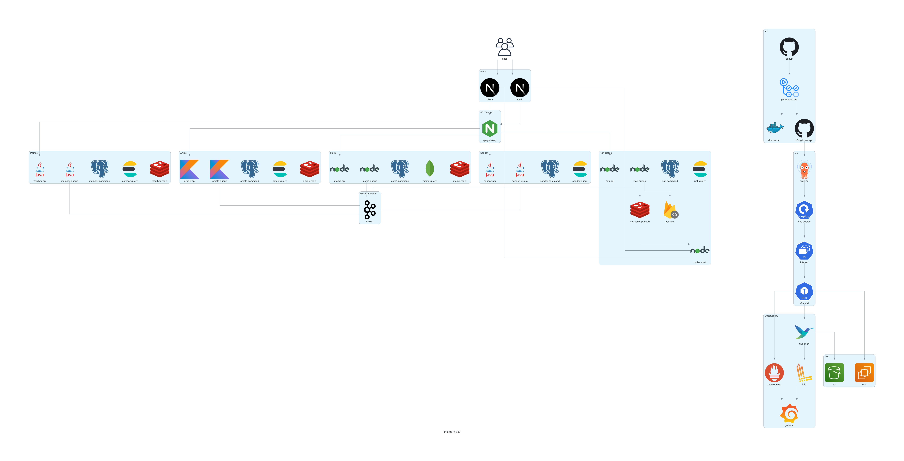

# choimory-architectures

- `python diagrams`로 아키텍처 다이어그램을 코드로 관리하는 프로젝트다.
- 각 아키텍처는 디렉토리별 Python 파일과 생성 이미지로 구성한다.
- 현재 관리 대상은 `choimory-dev` 아키텍처다.

---

# choimory-dev



## 파일 구성

- `choimory-dev/choimory-dev-architecture.py`: choimory-dev 아키텍처 다이어그램 코드
- `choimory-dev/choimory-dev.png`: 생성된 아키텍처 이미지
- `choimory-dev/README.md`: choimory-dev 다이어그램 이미지 링크
- `choimory-dev/venv`: 다이어그램 생성을 위한 Python 가상환경

## 아키텍처 구성

- `Front`: 사용자용 `client`, 관리자용 `admin`
- `API Gateway`: 프론트와 백엔드 도메인 API 사이의 진입점
- `Member`: Java 기반 `member-api`, `member-queue`, PostgreSQL, Elasticsearch, Redis
- `Article`: Kotlin 기반 `article-api`, `article-queue`, PostgreSQL, Elasticsearch, Redis
- `Memo`: Node.js 기반 `memo-api`, `memo-queue`, PostgreSQL, MongoDB, Redis
- `Sender`: Java 기반 `sender-api`, `sender-queue`, PostgreSQL, Elasticsearch
- `Notification`: Node.js 기반 `noti-api`, `noti-queue`, `noti-socket`, PostgreSQL, Elasticsearch, Redis Pub/Sub, FCM
- `Message broker`: 각 도메인의 queue 컴포넌트가 연결되는 Kafka broker
- `CI`: GitHub, GitHub Actions, DockerHub, K8s GitOps 리포지토리
- `CD`: ArgoCD, K8s Deploy, ReplicaSet, Pod
- `Infra`: EC2, S3
- `Observability`: Fluent Bit, Loki, Prometheus, Grafana

## 주요 흐름

- 사용자는 `client`, `admin` 프론트를 사용한다.
- `client`, `admin`은 `api-gateway`를 통해 `member-api`, `article-api`, `memo-api`, `sender-api`, `noti-api`를 호출한다.
- `noti-socket`은 실시간 알림 통신을 위해 `client`, `admin`과 직접 연결된다.
- 각 도메인의 queue 컴포넌트는 message broker와 연결된다.
- `sender-api`는 공용 발송 API이며 `sender-queue`를 직접 호출하지 않는다.
- GitHub push 이후 GitHub Actions가 Docker 이미지를 빌드하고 DockerHub에 push한다.
- GitHub Actions는 K8s GitOps 리포지토리의 Kustomize 이미지 태그를 갱신한다.
- ArgoCD는 K8s GitOps 리포지토리를 감시하고 변경사항을 K8s에 sync/apply한다.
- Pod 로그는 Fluent Bit이 수집해 Loki로 보내고 Grafana에서 조회한다.
- Fluent Bit은 로그 장기 보관을 위해 S3에도 로그를 보낼 수 있다.
- Prometheus는 Pod 메트릭을 수집하고 Grafana에서 확인한다.

---

# 실행 방법

## 사전 준비

```shell
brew install graphviz
dot -V
```

## 이미지 생성

```shell
cd choimory-dev
../choimory-dev/venv/bin/python choimory-dev-architecture.py
```

- 실행하면 `choimory-dev/choimory-dev.png`가 갱신된다.
